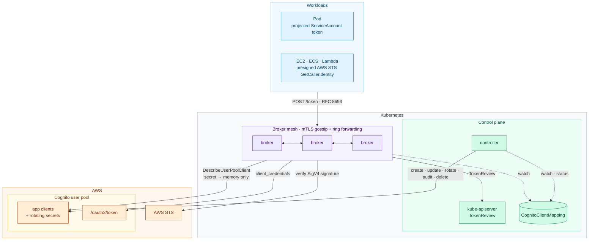
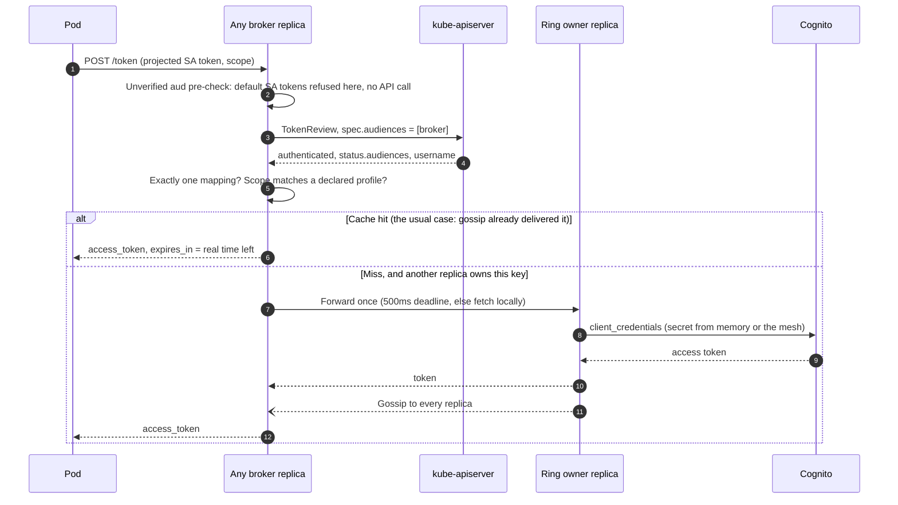
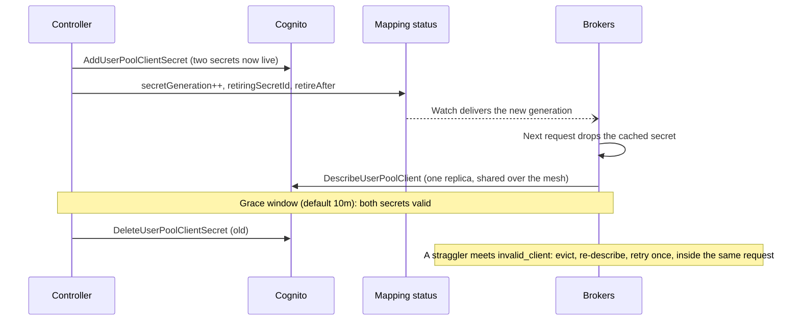

<p align="center">
  <picture>
    <source media="(prefers-color-scheme: dark)" srcset="docs/assets/logo-dark.svg">
    
  </picture>
</p>

**STS for Cognito.** Workloads exchange the identity they already have — a
Kubernetes ServiceAccount, or an AWS IAM role — for a Cognito
`client_credentials` access token. They never hold a client secret, and
nothing durable is stored outside Cognito.

Cognito's token endpoint accepts only `client_id` + secret: no client
assertions, no `private_key_jwt`, no mTLS. So the usual answer (RFC 7523, as
Curity and Keycloak do it) is unavailable, and teams end up copying client
secrets into every workload that calls a Cognito-protected API. recognito
removes that: a controller owns the app clients and their secrets, and a broker
hands out tokens to workloads that prove who they are.

> [!NOTE]
> **recognito never issues, re-signs or modifies tokens.** It only mediates:
> it calls Cognito's own token endpoint with the app client's credentials and
> returns the access token Cognito issued, byte for byte. recognito holds no
> signing keys and publishes no JWKS. Your APIs keep validating tokens against
> your user pool's JWKS exactly as they do today, and Cognito remains the only
> issuer they need to trust.

## Architecture



- A **`CognitoClientMapping`** says "this ServiceAccount, or this IAM role, may
  get tokens with these scope profiles from this user pool".
- The **controller** turns each mapping into a Cognito app client, rotates its
  secret on a schedule, audits it for drift, and deletes it with the mapping.
- The **broker** authenticates the caller, finds the one mapping that
  authorizes it, and returns a Cognito access token. Cognito stays the issuer:
  the broker never mints or signs anything.
- **Broker replicas form a mesh**, so the fleet fetches each token and each
  secret once rather than once per replica.

### One exchange



### Secret rotation, with nobody noticing



## Under the hood: the broker mesh

Broker state is a cache of things Cognito can always re-derive, so replicas
never need to *agree*. They only need to *converge*. That one observation
drives the whole design ([ADR-3](docs/ADRS.md), [ADR-5](docs/ADRS.md)).

### Tokens are a CRDT

Each replica's token cache is a state-based CRDT: a map from
`(client_id, scope set)` to a token, where merging two entries keeps the one
that **expires later**, with ties broken on the token bytes
([`token::merge`](crates/cache/src/token.rs)). That join is commutative,
associative and idempotent, which buys several things:

- **No consensus.** Replicas exchange entries over a channel that may lose,
  duplicate or reorder messages, and still end up identical. Raft would buy
  linearizability for state nobody needs to be linearizable, at the cost of
  availability under partition; it was rejected (ADR-3, the CALM argument).
- **No tombstones.** Entries expire on their own clock, so deletion never has
  to propagate. A replica that missed an update simply holds a token that
  expires sooner.
- **Concurrent fetches are harmless.** Access tokens are parallel-valid:
  Cognito honours every one it issues. Two replicas fetching the same key at
  once both produce good tokens, and the merge picks one. Refresh tokens would
  break this, since each use invalidates the last, so they are refused
  outright (ADR-11).

**Secrets are deliberately not a CRDT.** A client secret has a single writer
(the controller) and never expires, so a "later wins" join would be wrong.
Secrets merge by `secretGeneration`: a higher generation replaces ours, and an
older one is refused, so a lagging peer can never roll a rotation back
(ADR-10).

### Rendezvous hashing routes the cold path

When a key is missing everywhere, one replica should fetch it, not all of
them. Each replica computes the key's owner independently with
[rendezvous (highest-random-weight) hashing](crates/cache/src/ring.rs):
`owner = argmax over peers of hash(key, peer)`.

- **No coordination.** Every replica with the same peer list picks the same
  owner.
- **Minimal disruption.** Losing a peer moves only the keys it owned, and
  adding one takes about `1/n` of them, with no virtual nodes or ring structure
  to maintain.
- **Stable across builds.** The hash is FNV-1a with a SplitMix64 finalizer,
  and a test pins its output, so old and new binaries agree on owners during a
  rolling upgrade.
- **Forward once, fail open.** A non-owner forwards a miss to the owner with a
  500ms deadline; a forwarded request is never forwarded again; and anything
  slow or unreachable falls back to a local fetch. The ring decides who calls
  Cognito, never whether a caller gets a token.

### How state moves

| Mechanism | When | What |
|---|---|---|
| **Singleflight** | Concurrent misses on one replica | One fetch per key; everyone else waits for its result |
| **Delta gossip** | Every local fetch | Batched for 20ms and pushed to every peer, so their next request is a hit |
| **Anti-entropy** | About every second, with one random peer | Push-pull against a digest (`key → expiry`, `client → generation`); repairs anything a delta missed |
| **Warm-up** | Before `/readyz` passes | Pull from two peers, so a restarted replica starts with the fleet's state |
| **Jittered refresh** | Lazily, on a read past the refresh point | Each replica refreshes at its own point between 60% and 80% of a token's lifetime, so replicas don't all refresh one key at once; no timers |

Every replica holds every token: the key space is bounded by mappings × scope
profiles, so full replication is cheap, every hit is local, and a rolling
restart loses nothing because no token lives only on the replica that fetched
it.

## Highlights

### Security

- **No secrets in workloads.** Client secrets live in Cognito and in broker
  memory, nowhere else: no Kubernetes Secrets, no Secrets Manager copies, no
  disk.
- **Audience binding on both doors.** A pod's default ServiceAccount token is
  refused before any API call and counted as an attack signal — the
  CVE-2025-32963 class that hit MinIO's STS, with its own
  [regression suite](crates/broker/tests/audience_cve_2025_32963.rs).
  SigV4 callers must sign an `x-recognito-audience` header, and the broker
  forwards its own value, so AWS STS itself enforces the binding.
- **SigV4 hardened against how others broke.** The broker chooses the AWS STS
  host and action and parses the answer strictly (Vault's CVE-2020-16250), and
  it refuses duplicated, case-variant or percent-encoded parameters
  (aws-iam-authenticator's CVE-2022-2385 class). EKS and Vault tokens replayed
  at the broker are named as such. A URL presigned by real boto3 is
  [pinned as a test](crates/broker/tests/sigv4_audience_binding.rs).
- **Fails closed on ambiguity.** If two mappings claim one identity, the
  caller is refused rather than silently routed to either. Only assumed roles
  from allowlisted accounts are accepted, never IAM users or root.
- **Credentials never print.** Tokens, secrets and presigned URLs are redacted
  from `Debug` and logs, and error bodies never echo what the caller sent.
- **The mesh is locked down.** Peers use mTLS against a dedicated CA, and a
  NetworkPolicy keeps everything else off the peer port.

### Efficiency: Cognito's quotas cannot be raised, so they are spent carefully

- **The fleet fetches once.** In a 3-replica cluster, 60 exchanges across 3
  scopes cost **3** token calls and **1** `DescribeUserPoolClient`. Without the
  mesh that would be up to 9 token calls.
- **Rolling restarts are free.** New replicas pull state from their peers
  before reporting ready. A full rolling restart under load made **0** Cognito
  calls and failed **0 of 633** requests.
- **Steady state costs nothing.** The controller decides from CRD status
  alone, so a mapping resynced 100 times makes zero AWS calls
  ([tested](crates/controller/tests/lifecycle.rs)). Drift detection runs in a
  separate audit loop at 1 RPS.
- **Bounded cache keys.** Callers pick named scope profiles, not arbitrary
  subsets, so the number of cache entries per client is whatever the manifest
  declares, never a powerset.
- **Budgets enforced in code.** Rate limiters cover every Cognito call; the
  broker fails fast rather than queueing, and the controller backs off when
  Cognito throttles it.

### Resilience

- **Zero-downtime secret rotation** on Cognito's two-secret API, with a grace
  window. It is crash-safe: a rotation interrupted mid-way is finished on the
  next reconcile, never repeated.
- **Self-healing.** A hand-edited app client is restored; a deleted one is
  re-created; a lost status write is adopted by name instead of duplicated.
- **Fail-open mesh.** If a ring owner is slow or down, the asking replica
  fetches the token itself. Anti-entropy repairs anything gossip missed.
  Turning the mesh off falls back to replicas fetching for themselves.
- **Graceful shutdown.** On SIGTERM a broker reports not-ready and keeps serving
  until the Service stops routing to it, then drains.

### Operations

- **One `kubectl apply -k deploy/`** installs the CRD, both workloads,
  least-privilege RBAC, the PDB, the Services and the NetworkPolicy. IAM
  policies are scoped to one pool.
- **Admission-time validation.** CEL rules enforce exactly one principal per
  mapping and an immutable `userPoolId`; the CRD is generated from the Rust
  types and CI checks for drift.
- **Observable.** Each exchange writes one JSON audit line; Prometheus
  metrics include a dedicated attack-signal counter and the mesh's health; and
  `POST /whoami` shows who the broker thinks you are, without issuing a token.
- **Small and boring to run.** A 76 MB distroless non-root image with a single
  rustls/ring TLS stack, and TLS certificates that reload on renewal without a
  restart.

## Quick start

```sh
# 1. IAM roles from deploy/iam/, TLS certificates (deploy/examples/), and an
#    overlay filling the REPLACE_WITH_ placeholders. Then:
kubectl apply -k deploy/

# 2. Map a ServiceAccount to scopes.
kubectl apply -f deploy/examples/mapping-serviceaccount.yaml
kubectl get ccm -n payments        # wait for Ready=True

# 3. From a pod with a broker-audience projected token:
curl -sS https://cognito-broker.example.com/token \
  --data-urlencode grant_type=urn:ietf:params:oauth:grant-type:token-exchange \
  --data-urlencode subject_token_type=urn:ietf:params:oauth:token-type:jwt \
  --data-urlencode subject_token@/var/run/secrets/recognito/broker-token \
  --data-urlencode scope=payments/read
```

Calling from outside the cluster with SigV4 is in
[docs/CLIENTS.md](docs/CLIENTS.md); the full install is in
[docs/OPERATIONS.md](docs/OPERATIONS.md).

## Documentation

| | |
|---|---|
| [docs/CLIENTS.md](docs/CLIENTS.md) | Calling the broker from a pod or from AWS, scopes, errors |
| [docs/OPERATIONS.md](docs/OPERATIONS.md) | Install, configuration, the mesh, rotation, metrics, alerts, failure modes |
| [docs/DESIGN.md](docs/DESIGN.md) | Architecture, quota model, failure posture |
| [docs/ADRS.md](docs/ADRS.md) | Every decision, including the rejected ones |
| [CHANGELOG.md](CHANGELOG.md) | Release notes |

## Layout

| Path | What it is |
|---|---|
| [crates/api/](crates/api/) | `CognitoClientMapping` CRD types, scope profiles, AWS role identities, rate limiter, metrics |
| [crates/cache/](crates/cache/) | Token cache, rendezvous ring, replication hooks — no kube, no AWS, no `api` dependency |
| [crates/broker/](crates/broker/) | Token exchange: both authentication doors, mapping index, secret cache, Cognito fetcher, HTTP/TLS server, peer mesh (`cluster/`) |
| [crates/controller/](crates/controller/) | Reconciler, rotation, drift audit, and `recognito-crdgen` |
| [deploy/](deploy/) | Kustomize base, generated CRD, IAM policies, examples |

## Status

**v0.1.0.** Token exchange from both doors, the controller lifecycle, the
broker mesh, and packaging are complete and tested; see
[CHANGELOG.md](CHANGELOG.md). Not in this release, each with an ADR and a
trigger: push-mode Secret delivery (ADR-12), local JWKS verification (ADR-16),
controller leader election (ADR-18), and an encrypted cache snapshot for
whole-fleet loss (ADR-8).

The broker and controller have run against a real Kubernetes apiserver (kind),
including real TokenReview, CEL admission and a 3-replica mesh. **AWS has only
been faked** at its API boundaries; run the
[verification steps](docs/OPERATIONS.md#install) against a real user pool in a
staging account before production.

## Development

The toolchain is pinned in [rust-toolchain.toml](rust-toolchain.toml); `rustup`
installs it on first use.

```sh
cargo test --workspace
cargo clippy --workspace --all-targets -- -D warnings
cargo run --bin recognito-crdgen > deploy/crd.yaml   # regenerate the CRD
docker build -t recognito:dev .
```

Start with the invariants in [CLAUDE.md](CLAUDE.md), then
[docs/DESIGN.md](docs/DESIGN.md). Every rejected design lives in
[docs/ADRS.md](docs/ADRS.md) with its reasoning and, where deferred rather than
rejected, an explicit metric trigger.
